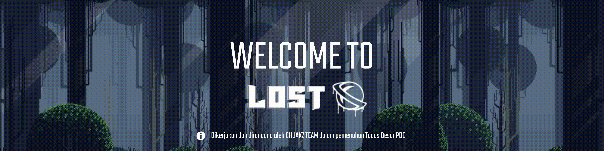
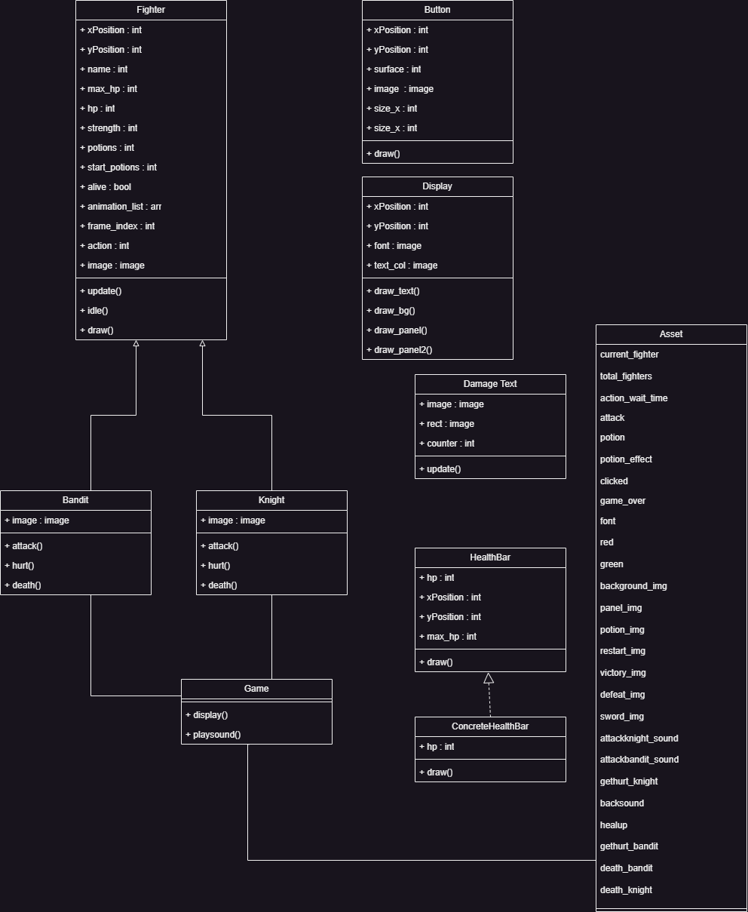

<div align="center">

<h1> Lost Is A Game Created by CHUAKZ Team </h1>

[](#)
[](#)
[](#)
</div>

## **Table Of Contents**
[Contributing](#member-of-chuakz-team)

[Introduction Game](#introduction-game)

[Installation Steps](#instalation-steps)


## **Introduction Game**
In this game, we present a game experience that combines pixelated graphic elements with a turn based combat system. The main character in this game will face a number of enemies that must be fought in turn. Both players and enemies will have a basic attack that reduces health points. However, not only basic attacks, there is the ability to heal using potions. However, it is important to note that the potions available in this game are limited in quantity, so players must manage their usage wisely.

## **Member Of CHUAKZ Team**

|  [<br /><sub><b>Kevin Simorangkir</b></sub>](https://github.com/kevinsimorangkir21)<br /> 121140150  | [<br /><sub><b>Ignatius Krisna</b></sub>](https://github.com/inExcelsis1710)<br />121140037  |  [<br /><sub><b>Rizka Fauziyah</b></sub>](https://github.com/Rizkacantik)<br /> 121140133 | [<br /><sub><b>Nur Hikmah Juliyanti</b></sub>](https://github.com/nurhikmah137)<br />121140137  | [<br /><sub><b>M. Rizki Alfaina</b></sub>](#)<br /> 121140228  | [<br /><sub><b>Ferreyla Setara Ibn</b></sub>](#)<br /> 121140207 |
|--|--|--|--|--|--|

## **Instalation Steps**
<li> Install Python 3.6 or higher </li>
<li> Install python-pip or python3-pip </li>
Open terminal where you want ti clone the repository and run the following command :

```bash
git clone https://github.com/kevinsimorangkir21/Tugas-Besar-PBO.git
cd Tugas-Besar-PBO
```

After that it is expected to install pygame
```bash
  pip instal pygame
```

## **Running the Game with Python**
<li> Install Python 3.6 or higher</li>
Run the following command to start the game:

```
python3 main.py
```

Alternative command:

```
python main.py
```

## **UML Diagram**


## **Screenshots**


## **Video Demo Game LOST**
