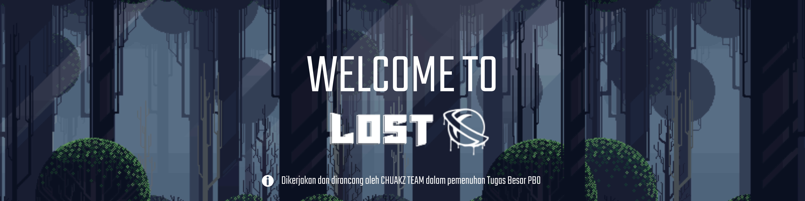
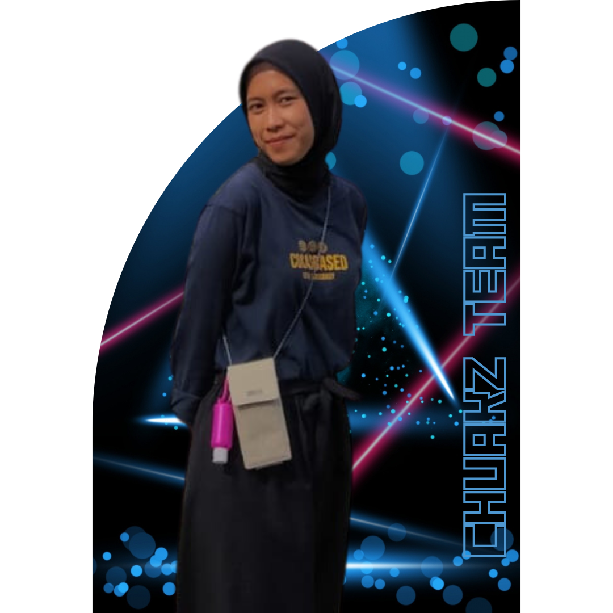
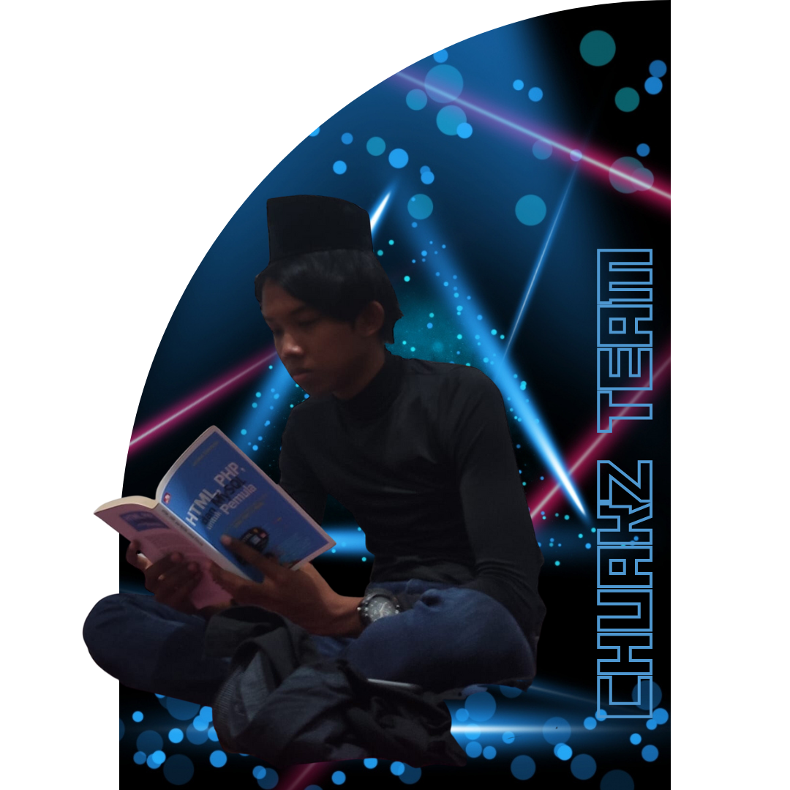

## **Introduction Game**
In this game, we present a game experience that combines pixelated graphic elements with a turn based combat system. The main character in this game will face a number of enemies that must be fought in turn. Both players and enemies will have a basic attack that reduces health points. However, not only basic attacks, there is the ability to heal using potions. However, it is important to note that the potions available in this game are limited in quantity, so players must manage their usage wisely.

## **Member Of CHUAKZ Team**

|  [<br /><sub><b>Kevin Simorangkir</b></sub>](https://github.com/kevinsimorangkir21)<br /> 121140150  | [<br /><sub><b>Ignatius Krisna</b></sub>](https://github.com/inExcelsis1710)<br />121140037  |  [<br /><sub><b>Rizka Fauziyah</b></sub>](https://github.com/Rizkacantik)<br /> 121140133 | [<br /><sub><b>Nur Hikmah Juliyanti</b></sub>](https://github.com/nurhikmah137)<br />121140137  | [<br /><sub><b>M. Rizki Alfaina</b></sub>](#)<br /> 121140228  | [<br /><sub><b>Ferreyla Setara Ibn</b></sub>](#)<br /> 121140207 |
|--|--|--|--|--|--|

## **Instalasi**

Silahkan untuk melakukan clone Github menggunakan Git

```bash
  git clone https://github.com/kevinsimorangkir21/Tugas-Besar-PBO.git
```

Setelah itu diharapkan untuk menginstall pygame

```bash
pip instal pygame
```
